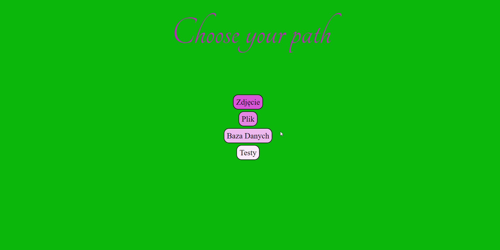

# Crypto

A project that was created during the studies lectures. It presents the basics of cryptography using the TripleDES encryption algorithm. The application presents three functionalities of encryption and decryption:
- photos in jpg format
- a string with writing and reading to a txt file
- a string with writing and reading into the database

It has also tested using the Jasmine framework.

# Setup
Update info about database in main.js. 

## Used technologies
* SASS
* Firebase
* CryptoJS

# Start application
You can launch local server based on index.html file.

## Usage

## Example of usage

